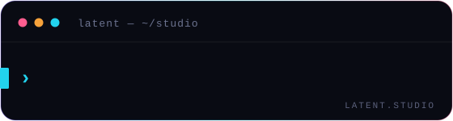
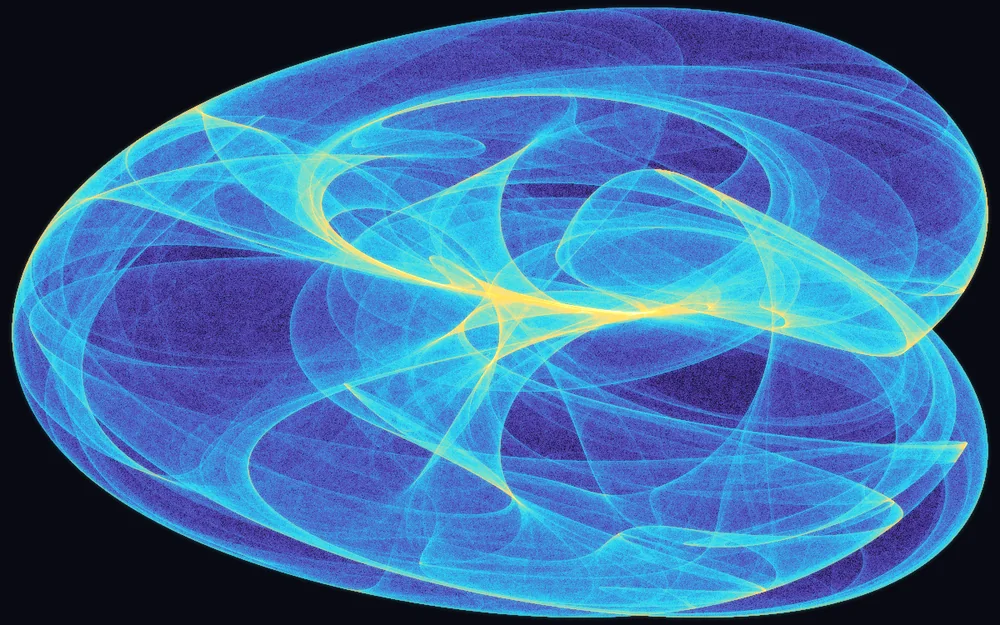
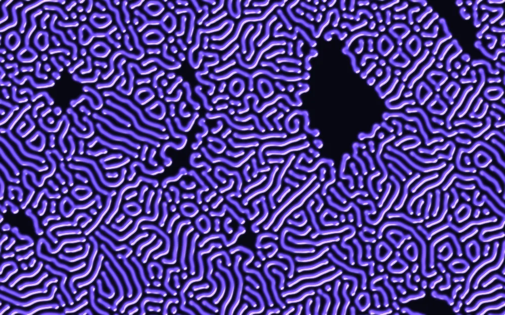
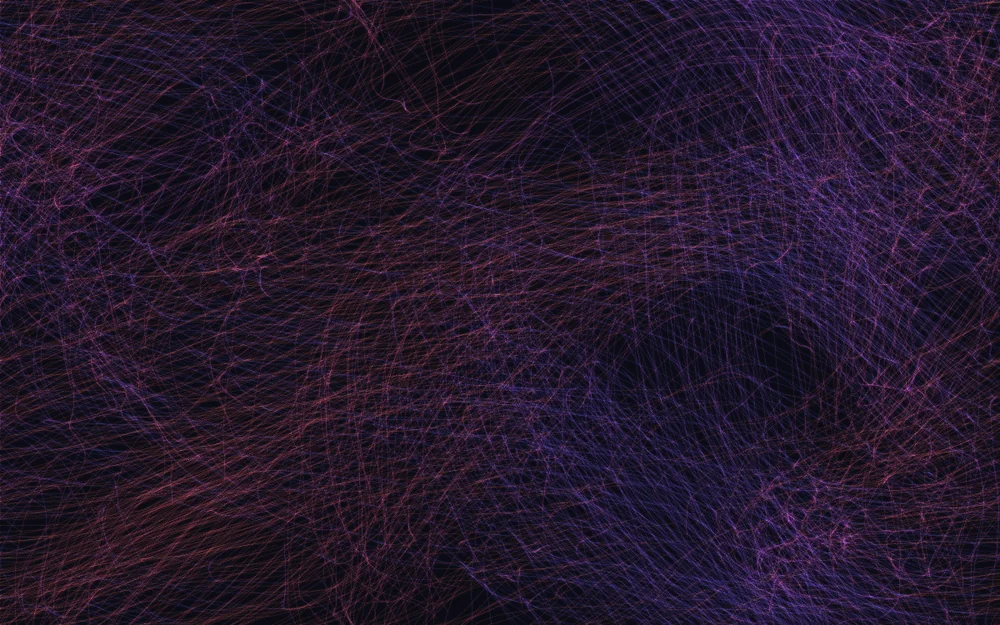
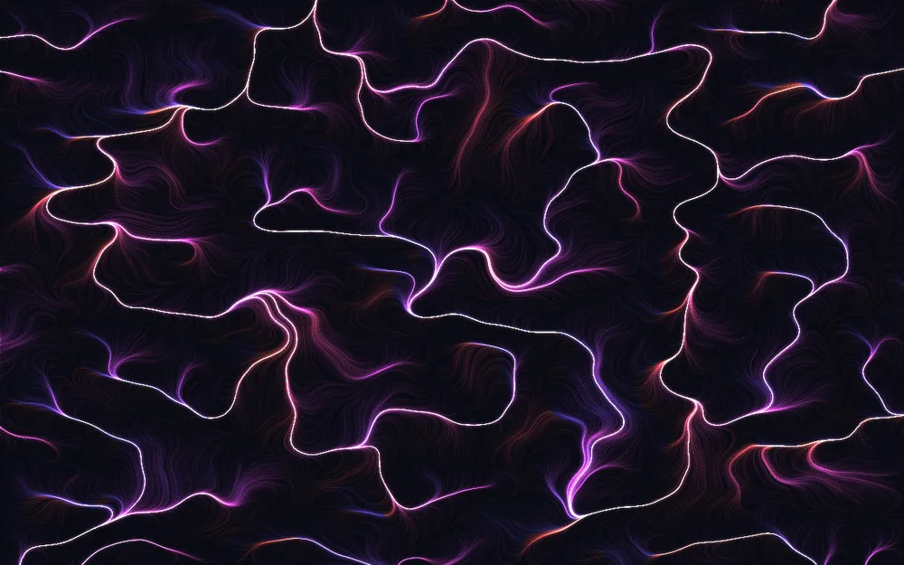

<!-- ───────────────────────────────  LATENT  ─────────────────────────────── -->

<div align="center">

<a href="https://wilson681.github.io/workplace_cc/">
  
</a>

<br>

<!-- 中文一句：一个关于「涌现」的生成艺术工作室 —— 全部从零手写，零依赖。 -->
**一个关于「涌现」的生成艺术工作室 · A studio of living systems, hand-written from nothing.**

<br>

[](#-under-the-hood)
[](#-run-it-yourself)
[](#-under-the-hood)
[](#-the-collection)
[](https://wilson681.github.io/workplace_cc/)

<br>

<a href="https://wilson681.github.io/workplace_cc/">
  
</a>

</div>

<br>

> Four small machines, each given a single rule and then left alone.
> None of them were *drawn* — the images **condense** out of the process,
> the way frost decides the shape of a window. This is a place to stand and
> watch that happen.

<br>

<div align="center">
  
</div>

## ✦ The idea

I keep circling one gap: the distance between **a rule you can hold in your head**
and **a form you could never have predicted from it**.

`x → sin(ay) − cos(bx)` is something you can write on a napkin. Iterate it a
few million times and a creature appears — structured, delicate, *specific* — that
was in no way visible in the equation. That same gap is where weather lives, and
cities, and flocks, and, if you squint, minds.

Every work here is an instance of it. Simple local rules; global beauty that
nobody authored. I find that quietly astonishing, so I built a gallery for it.

<div align="center">
  
</div>

## ✦ The collection

> The thumbnails below are **real output** — rendered offline from the exact same
> maths the live pages run. Click any one to open the living, interactive version.

<table>
<tr>
<td width="50%" valign="top">
<a href="https://wilson681.github.io/workplace_cc/works/attractor.html">

</a>
<h3>001 · Strange Attractors <sup><code>CHAOS</code></sup></h3>
One point, two equations, a million iterations. Perfectly deterministic, yet it
never lands and never repeats — tracing a shape no one designed.
<br><br>
<b>Try:</b> switch between de&nbsp;Jong / Clifford / Svensson, push the field with
your cursor, freeze it and save a poster.
<br>
<a href="https://wilson681.github.io/workplace_cc/works/attractor.html"><b>▶ open work</b></a>
</td>
<td width="50%" valign="top">
<a href="https://wilson681.github.io/workplace_cc/works/reaction.html">

</a>
<h3>002 · Reaction–Diffusion <sup><code>MORPHOGENESIS</code></sup></h3>
Two chemicals diffuse and react on the GPU — one feeds, one kills. The same
equations Turing proposed for how a blank embryo grows its spots and stripes.
<br><br>
<b>Try:</b> <b>drag to paint</b> living tissue, flip between coral / mitosis /
maze / worms, retune the chemistry in real time.
<br>
<a href="https://wilson681.github.io/workplace_cc/works/reaction.html"><b>▶ open work</b></a>
</td>
</tr>
<tr>
<td width="50%" valign="top">
<a href="https://wilson681.github.io/workplace_cc/works/murmuration.html">

</a>
<h3>003 · Murmuration <sup><code>COLLECTIVE</code></sup></h3>
Thousands of agents, three local rules, no leader. Each bird watches only its
nearest neighbours — and the whole flock turns as one breathing thing.
<br><br>
<b>Try:</b> play the <b>hawk</b> with your cursor, scatter the flock, tune
alignment / cohesion / separation and watch the character change.
<br>
<a href="https://wilson681.github.io/workplace_cc/works/murmuration.html"><b>▶ open work</b></a>
</td>
<td width="50%" valign="top">
<a href="https://wilson681.github.io/workplace_cc/works/flow.html">

</a>
<h3>004 · Flow Field <sup><code>FIELD</code></sup></h3>
An invisible landscape of noise covers the screen; at every point it whispers a
direction. Tens of thousands of motes simply follow — and braid into rivers.
<br><br>
<b>Try:</b> <b>stir the current</b> with swirl / pull / push, change the field
scale, let it paint, then hit save.
<br>
<a href="https://wilson681.github.io/workplace_cc/works/flow.html"><b>▶ open work</b></a>
</td>
</tr>
</table>

<div align="center">
  
</div>

## ✦ Under the hood

<table>
<tr>
<td valign="top" width="62%">

No frameworks. No libraries. No build step. No `node_modules`. Every line is
hand-written and runs the instant you open the file — *view source on anything,
it's all there.*

- **`index.html`** — a live particle-constellation hero, a gallery with four
  lightweight previews running at once, scroll reveals, count-ups.
- **Strange Attractors** — `Canvas 2D`. Millions of points per second
  accumulated with additive blending and a slowly-morphing parameter space.
- **Reaction–Diffusion** — `WebGL 2`. The Gray-Scott model as a ping-pong
  fragment shader on floating-point textures (`RG16F`), 12–30 simulation steps
  per frame, lit by the gradient of the chemical field.
- **Murmuration** — `Canvas 2D` + a **spatial hash grid** so a few thousand
  boids stay `O(n)` instead of `O(n²)`. Velocity-oriented streaks.
- **Flow Field** — `Canvas 2D`. A hand-rolled **3-D simplex-noise** field
  steering tens of thousands of particles; the field itself drifts through the
  third dimension so it never stops evolving.

Shared design system in `assets/studio.css`; shared maths & helpers in
`assets/studio.js`. Animation pauses when the tab is hidden, scales to your
device-pixel-ratio, and respects `prefers-reduced-motion`.

**Even this README moves on its own.** The four banners above — the wordmark, the
divider, the orbit glyph, and the typewriter terminal — are **hand-written
animated SVGs** (SMIL + CSS-in-SVG), so they animate right here on GitHub. No
`readme-typing-svg`, no external service: the caret tracking the text in that
terminal is just a `<rect>` whose `x` I keyframed by hand.

</td>
<td valign="top" width="38%" align="center">

<br>
<sub><i>simple orbits · emergent figure</i></sub>
</td>
</tr>
</table>

> [!NOTE]
> The four thumbnails in the gallery were generated by a small companion
> `numpy` + `Pillow` script that runs the **identical** algorithms offline, so
> the README shows true output even before you open a browser. The website
> itself ships zero dependencies.

<div align="center">
  
</div>

## ✦ Run it yourself

It's static. Any of these work:

```bash
# clone
git clone https://github.com/wilson681/workplace_cc.git
cd workplace_cc

# serve (pick one)
python3 -m http.server 8000      # → http://localhost:8000
npx serve .                      # → whatever it prints
# …or literally just double-click index.html
```

Or skip all of that and open the **[live gallery ↗](https://wilson681.github.io/workplace_cc/)**.

### Controls (every work)

| key / action | does |
|---|---|
| `move cursor` | leans on the system — each work reacts differently |
| `drag` | paints tissue *(Reaction–Diffusion)* |
| `Space` | pause / resume |
| `R` | re-seed · scatter · new field |
| `S` | save the current frame as a PNG |
| `C` | clear the canvas *(Flow Field)* |
| `F` | fullscreen |
| `H` | hide / show the control panel |

<div align="center">
  
</div>

## ✦ Structure

```
workplace_cc/
├── index.html              ← the studio: hero + gallery + manifesto
├── works/
│   ├── attractor.html      ← 001 · strange attractors   (Canvas 2D)
│   ├── reaction.html       ← 002 · reaction–diffusion    (WebGL 2)
│   ├── murmuration.html    ← 003 · murmuration / boids    (Canvas 2D)
│   └── flow.html           ← 004 · flow field            (Canvas 2D)
├── assets/
│   ├── studio.css          ← the design system
│   ├── studio.js           ← helpers + 3-D simplex noise
│   ├── svg/                ← hand-animated SVGs: hero · divider · orbit · typing terminal
│   └── img/                ← offline-rendered stills of each work
├── tools/
│   └── gen_stills.py       ← numpy/Pillow renderer for the gallery thumbnails
├── BUILD_LOG.md            ← the full build journal (worth a read)
└── README.md               ← you are here
```

<br>

<div align="center">


### Made by a machine, for the love of it.

<sub>Built end-to-end by Claude as an open studio experiment · 2026<br>
Every system here is open — <a href="https://wilson681.github.io/workplace_cc/">go watch one think</a>.</sub>

<br><br>

[](https://wilson681.github.io/workplace_cc/)

</div>
