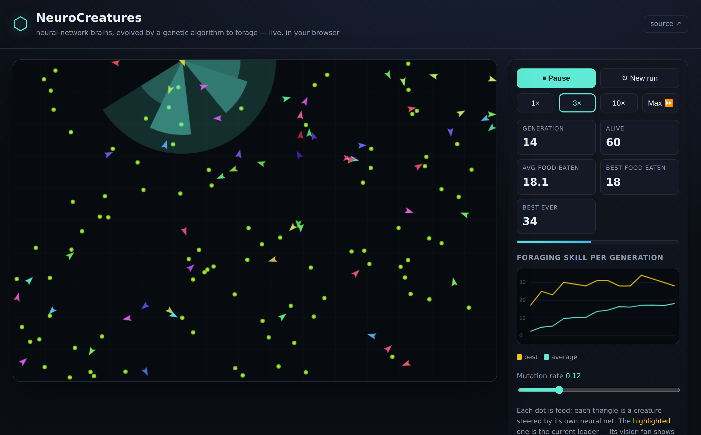

# 🧬 NeuroCreatures

**A neuroevolution life simulator.** A population of little creatures, each
steered by its own neural network, learns to find food — not by training on
data, but by *evolving*. The fittest foragers of each generation breed; their
children inherit and mutate their brains; repeat. Watch foraging skill climb,
live in your browser.

No frameworks, no build step, **zero runtime dependencies** — the neural
network and the genetic algorithm are written from scratch. The exact same
engine runs headless in Node (with tests proving it learns) and in the browser
(for the pretty part).

> **Two projects live in this repo.** This README covers **NeuroCreatures**. There's also
> **[PocketPDF](pocketpdf/)** → a privacy-first, 100%-in-browser PDF toolkit (merge / reorder /
> rotate / delete pages, images → PDF — your files never leave your device), with its own README,
> tests and end-to-end verification.



> Gold line = best forager per generation, teal = population average. They climb
> because evolution is working: random brains eat ~3 food items per life; after
> a dozen generations the average is ~18.

---

## Quick start

Requires **Node 20+**. Nothing to install.

```bash
# 1. Watch evolution happen in the browser
npm run web
#   → open http://localhost:8080/

# 2. Or run it headless and watch the numbers climb
npm run evolve -- --gens 60 --seed 1

# 3. Run the test suite (unit tests + an end-to-end "it really learns" test)
npm test
```

The headless runner prints a live foraging curve:

```
  gen   avg-eaten  best-eaten   foraging
  ----  ---------  ----------   ------------------------
     0       3.33          19   ██······················
    10      10.12          29   ██████··················
    20      17.28          33   ██████████··············
    40      18.78          28   ███████████·············
    59      19.20          30   ████████████············

summary: gen0 avg-eaten 3.33 → gen59 avg-eaten 19.20 (3.30× foraging) in 20708ms
```

Useful flags: `--gens N`, `--seed N`, `--pop N`, `--json runs/out.json`, `--quiet`.

---

## How it works

Each creature is a tiny autonomous agent. Every timestep it **senses**, **thinks**,
and **moves**, spending energy as it goes. Eating food restores energy; hitting
zero means death. Its only goal — the thing evolution selects for — is to eat.

```
        sensors                 brain (MLP)              motors
   ┌──────────────────┐     ┌──────────────────┐    ┌───────────────┐
   │ 5 vision sectors │ ──▶ │  6 → 10 → 2       │ ─▶ │ turn  (-1..1)  │
   │ + own energy     │     │  tanh everywhere  │    │ thrust (0..1)  │
   └──────────────────┘     └──────────────────┘    └───────────────┘
            ▲                        ▲
            │                 weights = the genome
       food on a torus      (a flat Float64Array)
```

- **Senses** — a fan of vision sectors across the creature's field of view.
  Each sector reports how close the nearest food in that direction is. Plus one
  input for its own energy ("hunger").
- **Brain** — a from-scratch feed-forward neural network (`src/nn.js`). All of
  its weights live in a single flat array, which *is* the genome.
- **Motors** — two outputs: how hard to turn, how hard to thrust.

### The evolution loop

1. Start with a population of **random** brains.
2. Drop them all into one shared world and simulate for a fixed time.
3. Score each creature by how much food it ate.
4. Breed the next generation (`src/evolution.js`):
   - **Elitism** — the best few brains carry over untouched.
   - **Tournament selection** — pick a handful at random, the fittest becomes a parent.
   - **Crossover** — a child's weights are mixed from two parents.
   - **Mutation** — perturb some weights with Gaussian noise.
5. Reset the world and repeat.

A small *shaping* reward for merely being near food gives evolution a gradient
to climb in the very first generations, before any brain is good enough to
actually land a meal. After that, eating dominates the score.

The world is a **torus** (edges wrap), so there are no walls to get stuck on and
no edge effects to pollute learning.

---

## Why you can trust that it learns

Everything is driven by a single seeded RNG (`src/rng.js`), so a whole run is
reproducible from one integer. That makes the behaviour *testable*:

- `test/` has unit tests for the RNG, the neural net (incl. a hand-computed
  forward pass), and the genetic operators.
- The headline test, `population learns to forage far better than it starts`,
  runs 25 generations and asserts that late-generation foraging is **more than
  double** the early generations'. Observed gains are ~3.8× — the assertion is
  deliberately conservative so it never flakes.

It's verified in the browser too: the app was driven in headless Chromium, ran
without a single JS error, and the on-screen average climbed from 0 to ~18 over
14 generations.

---

## Project layout

```
src/
  rng.js         seeded PRNG (mulberry32) + gaussian, pick, …   — the only randomness
  nn.js          from-scratch feed-forward neural network (flat-array weights)
  genome.js      genetic operators: random / mutate / crossover
  geom.js        torus geometry helpers (angle + coordinate wrapping)
  creature.js    an agent: sense → think → move → metabolise
  world.js       the toroidal environment; per-step update + eating
  evolution.js   the genetic algorithm: selection + breeding
  config.js      every tunable knob, in one place
  sim.js         ties it together; one Simulation, used by Node and the browser
bin/
  evolve.js      headless CLI runner with a live foraging chart
  serve.js       zero-dependency static server for the web app
web/
  index.html · style.css · app.js   the canvas visualiser
test/            node:test suites (run with `npm test`)
```

The design constraint that shaped all of this: **`src/` imports nothing**, uses
no Node- or browser-specific globals, and is therefore equally at home in a unit
test and inside a `<script type="module">`.

---

## Tuning

Open `src/config.js` (or pass overrides). A few knobs worth playing with:

| Knob | Effect |
| --- | --- |
| `evolution.mutationRate` | exploration vs. stability (also a live slider in the UI) |
| `evolution.population` | bigger = steadier evolution, slower per generation |
| `world.foodCount` | abundance; scarcer food = harsher selection |
| `creature.rays` / `fov` | how much of the world a creature can see |
| `brain.hidden` | hidden-layer sizes, e.g. `[10]` or `[12, 8]` |

---

## License

MIT — see [LICENSE](LICENSE).
