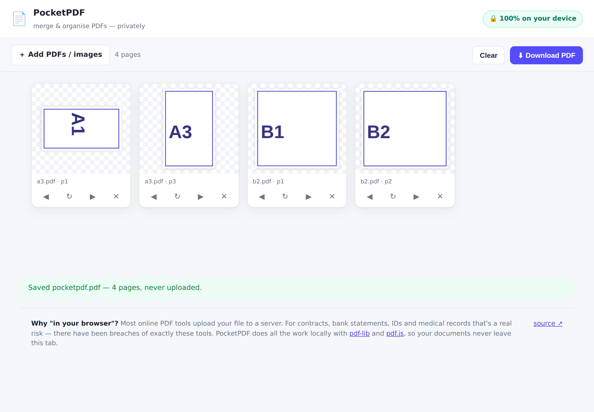

# 📄 PocketPDF

**Merge, organise, rotate and delete PDF pages — and turn images into PDFs — entirely in your browser.**
Your files are never uploaded. There is no server. It even works offline.



Drop in several PDFs and images, and every page becomes a thumbnail you can drag to reorder,
rotate, or delete. Hit **Download** and PocketPDF assembles a fresh PDF — all in your browser tab,
using [pdf-lib](https://github.com/Hopding/pdf-lib) and [pdf.js](https://github.com/mozilla/pdf.js).

---

## Why this exists (the one-paragraph business case)

Online PDF tools are a huge, durable market — iLovePDF alone draws ~287M visits/month, and Smallpdf
reportedly reached ~$8M ARR bootstrapped. But almost all of them **upload your file to a server**.
For the documents people most often need to merge or split — contracts, bank statements, payslips,
passports, medical records — that's a genuine risk, and it has bitten users: in 2024 two PDF tools
left ~89,000 user files (including passports and driving licences) exposed in an open S3 bucket, the
FBI warned about malicious online "PDF converters," and outlets like Experian now advise people not
to upload confidential files to web converters.

PocketPDF's pitch is the one thing the incumbents structurally **can't** copy without rebuilding
their business: **the file never leaves your device.** That claim is the product. And it turns the
usual constraint of "I have no backend" into the entire value proposition.

> This started as an experiment: *given no API keys and no server, what's worth building?* Doing the
> market research, the answer pointed squarely at a privacy-first, 100%-client-side document tool.

---

## Features (v1)

- **Merge** any number of PDFs into one.
- **Images → PDF** — drop JPG / PNG / WebP and they become pages.
- **Reorder** pages by dragging (or the ◀ ▶ buttons).
- **Rotate** and **delete** individual pages.
- **Thumbnail preview** of every page, rendered locally with pdf.js.
- **Download** a fresh PDF assembled with pdf-lib — nothing uploaded.

## Quick start

Requires **Node 20+** only for local serving/tests; the app itself is a static site.

```bash
npm install          # one-time: fetches pdf-lib for the test suite
npm run web          # serve the repo, then open http://localhost:8080/pocketpdf/web/
npm test             # run the PDF-operation test suite
```

Because it's a static site with vendored libraries, you can also host it on any static host
(GitHub Pages, Netlify, an S3 bucket) with zero backend.

---

## How it works

The whole engine is one small, isomorphic module, [`src/pdfops.js`](src/pdfops.js). Every function
takes and returns plain bytes, so the same code runs in the Node tests and in the browser:

```
buildFromPages(sources, pages)   ← the workhorse
```

The UI never calls separate "merge" / "split" / "rotate" endpoints. It just keeps an ordered list of
pages — each one a reference to *(source document, page index, rotation)* — and asks `buildFromPages`
to assemble exactly that. One operation expresses merge, reorder, extract, delete and rotate at once.

```
 web/app.js  ──drop files──▶  pdf.js (thumbnails)
      │                              │
      │  ordered list of pages       ▼
      └────────────────────▶  src/pdfops.js ──▶ pdf-lib ──▶ new PDF bytes ──▶ download
                                    (no network — ever)
```

`web/vendor/` holds self-contained builds of pdf-lib and pdf.js, so the app has **no runtime
dependency on any CDN** and works fully offline. In the browser an import map points the bare
`pdf-lib` specifier at the vendored bundle; in Node it resolves from `node_modules`.

## Tested for real

- **Unit tests** ([`test/pdfops.test.js`](test/pdfops.test.js)) build PDFs whose pages have distinct
  widths, run each operation, then read the result back to prove pages came out in the right order,
  with the right rotations, and that bad input is rejected.
- **End-to-end**: the app was driven in headless Chromium — two PDFs dropped in, a page deleted, a
  page rotated, then exported. The downloaded file was re-parsed and asserted to be exactly the
  expected pages, in the expected order, with the expected rotation — and the page logged **zero JS
  errors**. (That run also caught a real bug: a CDN-bundled pdf-lib was externalising its
  dependencies; the fix was to vendor a self-contained bundle.)

## Honest take on monetisation

The free, client-side core is the trust-builder and the SEO surface. The realistic paid tier is the
set of features that genuinely *do* need a server or heavier compute, and which the privacy core
makes credible to sell: high-fidelity **PDF → Word/Excel**, **OCR** for scanned documents, strong
**compression**, and e-signing — offered as an opt-in "Pro" where the user knowingly sends the file.
Self-host / white-label licensing is a second proven path (cf. Stirling-PDF). The MVP here is
deliberately the free, no-backend half — the part you can ship today and trust completely.

## License

MIT — see [../LICENSE](../LICENSE). Bundled libraries retain their own licenses (pdf-lib: MIT, pdf.js: Apache-2.0).
